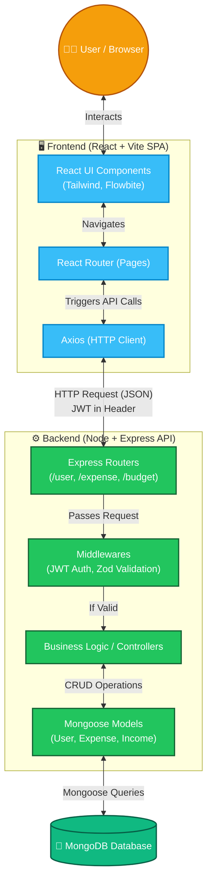

# TrackMySpend - Full Stack Overview

This file provides a high-level overview of the entire TrackMySpend application, covering both the **Frontend** and **Backend** architectures, their technology stacks, and how they connect.

## 🛠 Full Stack Technologies

The application is structured as a modern **MERN** (MongoDB, Express, React, Node.js) stack split into two distinct directories.

### 🖥 Frontend (Client-Side)
- **Framework:** React 19, initialized with Vite.
- **Routing:** React Router v7 (`react-router-dom`).
- **Styling & UI:** Tailwind CSS, DaisyUI, Flowbite React, and CoreUI components.
- **State Management / Data Fetching:** Axios for API calls, standard React hooks for state.
- **Visuals:** Chart.js (via `react-chartjs-2`) for reporting/charts, and `lucide-react` / `react-icons` for icons.
- **Special Features:** `tesseract.js` (OCR capabilities directly in the browser) and `html2pdf.js`.

### ⚙️ Backend (Server-Side)
- **Runtime & Framework:** Node.js with Express.js (v5.1).
- **Database:** MongoDB managed via Mongoose (v8.15).
- **Security & Auth:** JSON Web Tokens (JWT) for authentication, Zod for strict request body validation.
- **API Documentation:** Swagger (OpenAPI 3).
- **Special Features:** Also includes `tesseract.js` and AWS Textract SDK (suggesting robust backend OCR for receipt parsing) and Cron jobs for scheduled tasks.

---

## 🏗 High-Level Design (HLD) & Architecture Diagram

The application uses a decoupled Client-Server architecture. The React frontend is a Single Page Application (SPA) that communicates with the Express REST API via HTTP requests (JSON). 

Here is the High-Level flow and architecture:

### 🧩 Component Roles in Short:

1. **Frontend UI & Pages:** Renders the interface using React and Tailwind. Users input expenses, view budgets, and see charts.
2. **Axios:** Acts as the bridge. When a user submits an expense, Axios formats it as JSON and sends a `POST` request to the backend. It also attaches the JWT token for secure routes.
3. **Backend Routes:** The gateway of the API (e.g., `POST /expense/addexpense`). It matches the incoming URL to the right logic.
4. **Backend Middlewares:** 
   - *Auth Middleware:* Checks if the JWT from Axios is valid. If not, rejects the request before hitting the database.
   - *Zod Middleware:* Checks if the data (like amount, date) is the correct format.
5. **Controllers & Mongoose:** Handles the actual business logic (e.g., deducting an expense from a budget) and uses Mongoose to save or retrieve data from the MongoDB database.

## What's Next?
If this architectural overview makes sense, we can move on to the next file. We can either dive into the **Frontend structure (Pages and State)** or the **Backend Low-Level Design (LLD) (How specific modules like budgeting and reporting work)**.

Please let me know how you would like to proceed!
